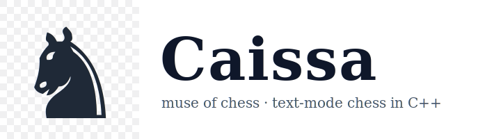

<p align="center">
  
</p>

Text-mode chess in C++ for the OOP2 final. Plays two-human or human-vs-AI.

API docs are live at **https://caissa-docs.ufazien.com** (generated from
the Doxygen comments under `src/`).


## Building

You need g++ (any version with C++17 — 6.3 works) and GNU Make.

```
make           # both binaries
make chess     # core only, what graders run
make chess-ai  # core + AI
make clean
```

The Makefile detects the shell, so it works from cmd.exe, PowerShell,
Git Bash, and Linux/macOS terminals. Binaries land in `bin/`.

## Running

```
./bin/chess                       # two-human game
./bin/chess-ai                    # asks "Play vs AI?" at startup
cat tests/games/4-mate/scholars.txt | ./bin/chess
```


## Tests

```
make test
```

Pipes every game file under `tests/games/` into `bin/chess` and compares
the last stdout line against the `# expected:` line written inside the
file. Currently 9 games — base moves, check, castling, en passant,
promotion, scholar's mate, stalemate, /resign, /draw. Requires bash
(use Git Bash on Windows).

There's also `make format` (clang-format) and `make doc` (Doxygen) if
you want them.


## Notes on the design

The board owns every piece via `std::unique_ptr<Piece>`, so there is no
manual `delete` anywhere. Captured pieces aren't actually removed from
the roster — they keep a `captured_` flag instead. This means
`execute_move` and `undo_move` are reversible without any allocation,
which is what makes the alpha-beta search cheap enough to feel instant
at depth 3.

Every legal-move enumeration (mate detection, stalemate detection,
engine move generation) goes through one templated helper,
`Board::for_each_legal_move`. Single source of truth for what "legal"
means, so I can't accidentally have the engine and the rules disagree.

---

## Ufazien Deployment

The Doxygen-generated API docs are hosted on Ufazien at
**https://caissa-docs.ufazien.com**.

### Build and deploy

1. Generate the docs locally:
```bash
make doc            # writes HTML into docs/api/
```

2. Push to Ufazien:
```bash
ufazien deploy      # uploads docs/api/
```
